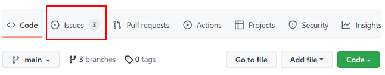
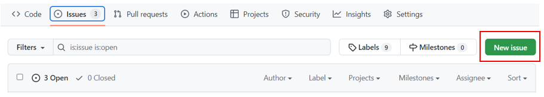
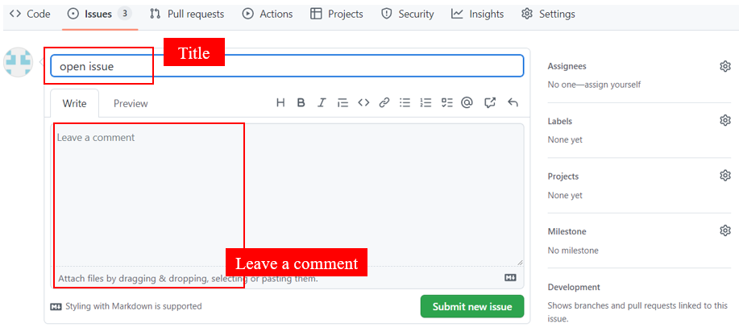
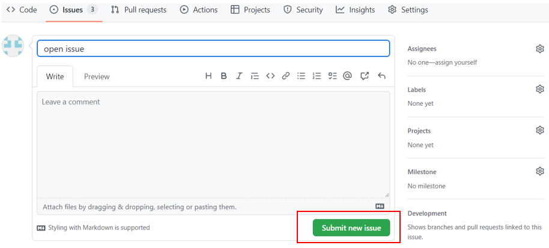
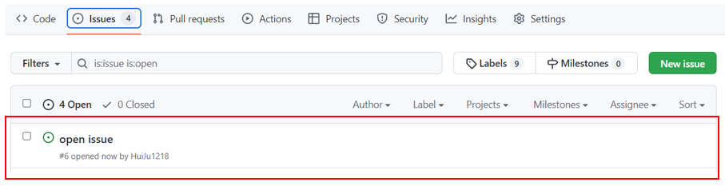
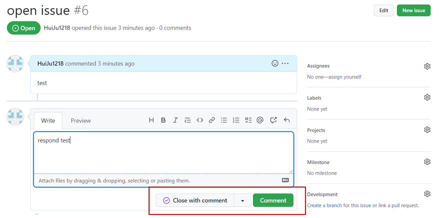
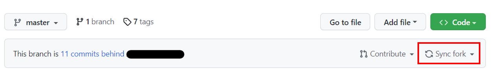

<!--
 Copyright (c) 2022 Innodisk Crop.
 
 This software is released under the MIT License.
 https://opensource.org/licenses/MIT
-->

# Table of contents
- [Table of contents](#table-of-contents)
- [How to open issue on github](#how-to-open-issue-on-github)
- [How to sync fork from the upstream repository](#how-to-sync-fork-from-the-upstream-repository)
- [How to contribute](#how-to-contribute)
  - [Code reviews](#code-reviews)
  
# How to open issue on github
Issues can track ideas, feedback, tasks, or bugs for work.

Follow the following step to open issue. 

1. Click the tap "Issues".
    

2. Click "New issue" to open a new issue.
    

3. Write the title and leave a comment.
    

4. After leave a comment, click the "Submit new issue" to open issue.
    

5. Issue is opened.
    
6. After issue is opened, everyone can discuss in the issue. And click "comment" to update the ideas. After all, can click "close comment" to close the issue.
   

# How to sync fork from the upstream repository
1. If the upstream repository has push the commit, just press `sync fork` to sync the newest content from the upstream repository.

# How to contribute
We'd love to accept your patches and contributions to this project. There are
just a few small guidelines you need to follow.

## Code reviews
All submissions, including submissions by project members, require review. We
use GitHub pull requests for this purpose. Consult
[GitHub Help](https://help.github.com/articles/about-pull-requests/) for more
information on using pull requests.