<!--
 Copyright (c) 2022 Innodisk crop.
 
 This software is released under the MIT License.
 https://opensource.org/licenses/MIT
-->
# TOC
- [What you will need](#what-you-will-need)
  - [Hardware](#hardware)
  - [Software](#software)
- [Setting up the SD Card Image](#setting-up-the-sd-card-image)
- [Connect your X261](#connect-your-x261)
- [Booting your X261](#booting-your-x261)
- [Next Steps](#next-steps)

# What you will need
## Hardware
- X261-SOM Board  
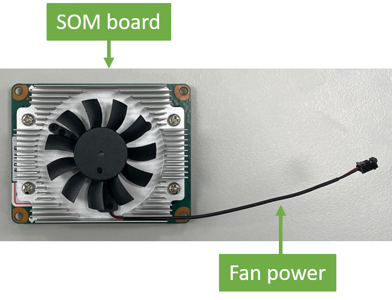  
- X261-Carrier Board
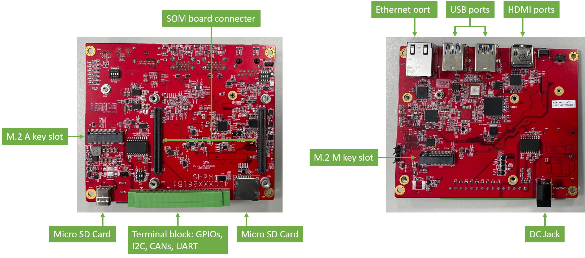 
- (optional) A Debug Board: You can use it to communicate with the host through UART
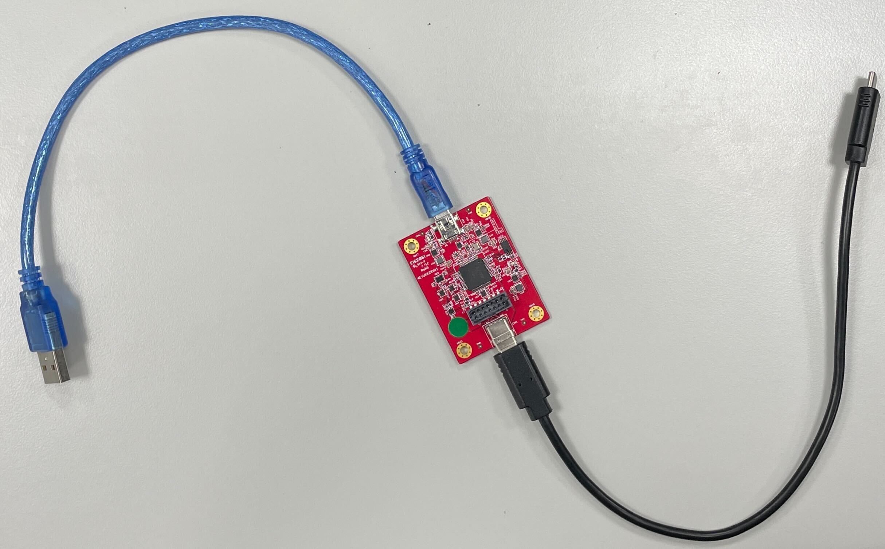
- A Power Supply
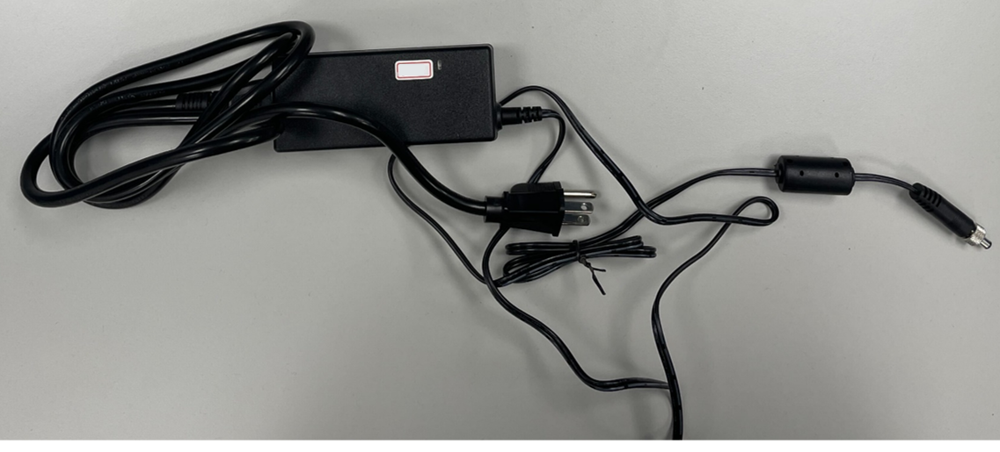
- A MicroSD Card: Please prepare a microSD card of 16GB or more.  
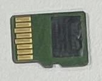
## Software
**EXMU-X261 has preloaded image in eMMC during manufacturing.** Once you have access to the platform, you can start using it right away. On the other hand, you can use our pre-built image to intuitively experience the potency of employing AI solutions on the platform.(the image provided please refer to [2.Software/pre-build-image](../2.Software/pre-build-image.md)). 

As mentioned above, if you decide to use our pre-built image. Please contact james_chen@innodisk.com. We will provide you with a [myinnodisk](https://myinnodisk.innodisk.com/myinnodisk/Login.aspx) account. Once inside, you will see as the following. And you can download the pre-built image you want.
 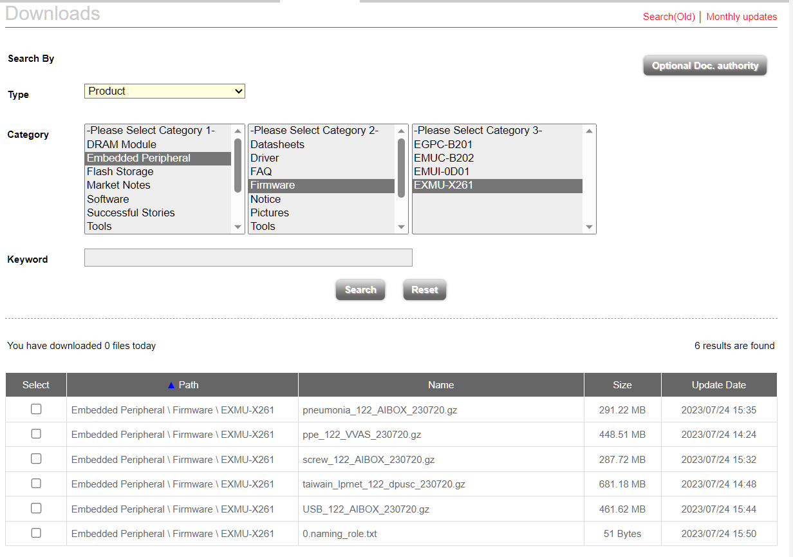

The pre-build image which you want to use, should correspond to the current BSP version that you have. For example, if you have BSP version 1.2.2, you must use a pre-build image that matches this version. You can refer to the [pre-build image naming rule](../4.FAQ/FAQ.md#pre-build-image-naming-rule) to choose the image you are going to use.

Then you can refer to the "Setting up the SD Card Image" section for first boot.

# Setting up the SD Card Image
You will need a computer to prepare the system for use on X261. Here we will introduce writing the system to the microSD card, and then no matter whether the operating system you are using is Windows or Linux, you can use the following flow normally.
1. Download the `X261 WIC Image` or `X261 .gz Image`(please contact james_chen@innodisk.com) to your computer.
2. Flash the image file to the microSD card according to the following instructions:
   1. Download and launch [Etcher](https://www.balena.io/etcher/).
   2. Select the image file to use.  
   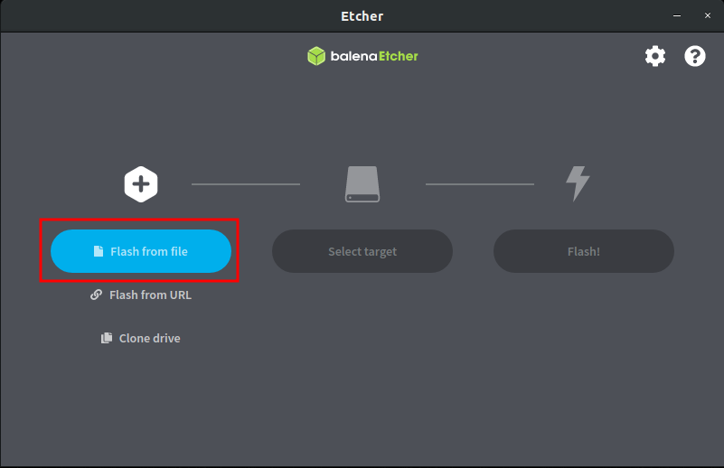
   1. Please insert the microSD card into your computer, then select the microSD Card to use.  
   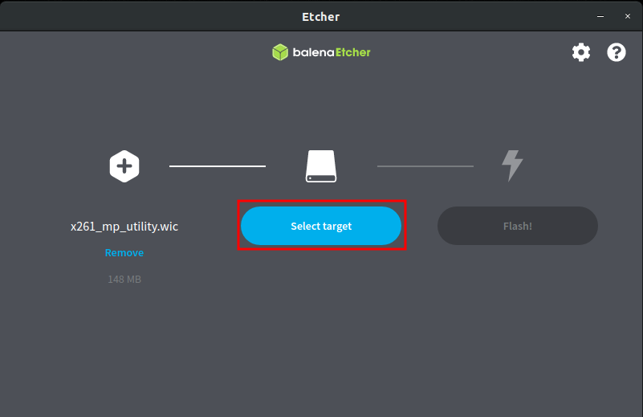  
   1. After clicking “Flash!”, it will take about 10-20 minutes.  
   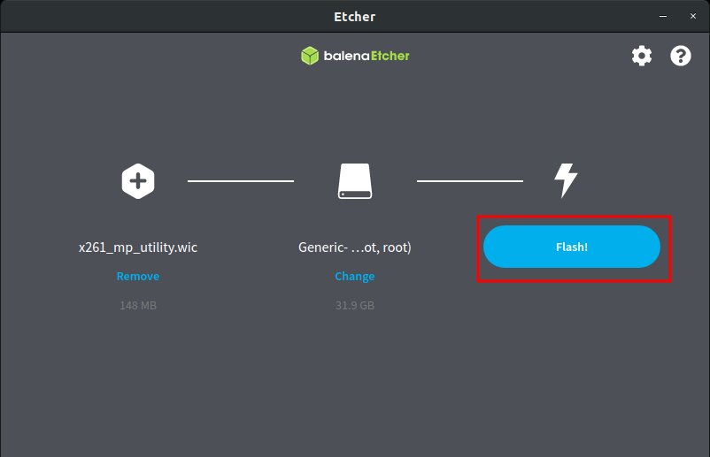  
   1. Done!  
   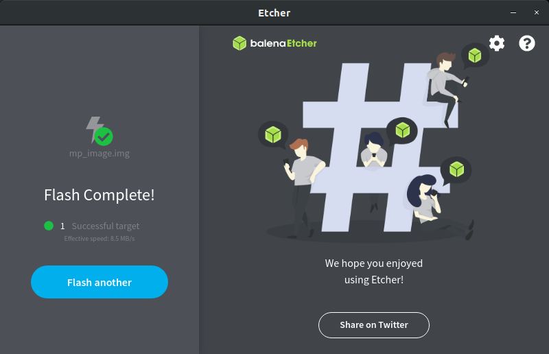  
   1. Finally, please safely remove your SD card.  
# Connect your X261  
1. Insert the microSD card containing the X261 image in the microSD card slot.  
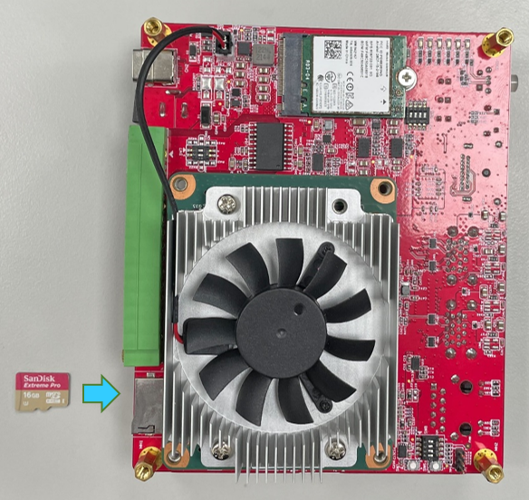  
2. (optional) If you want to transfer x261 information via UART, please use debug board.  
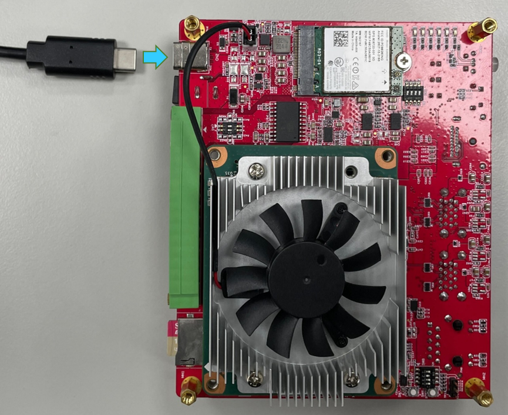  
3. (optional) If you want to display X261 information through the screen, please plug in the HDMI cable.  
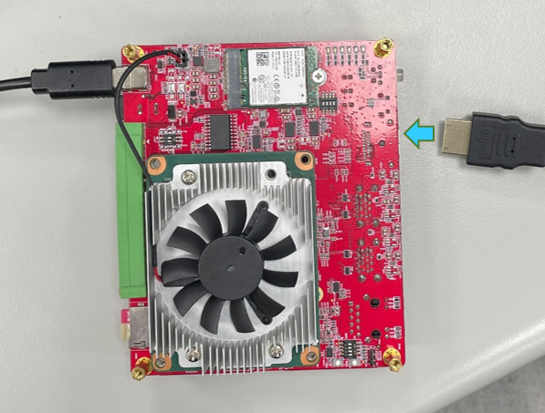  
4. Finally, system boot immediately after plugging in the power supply.  
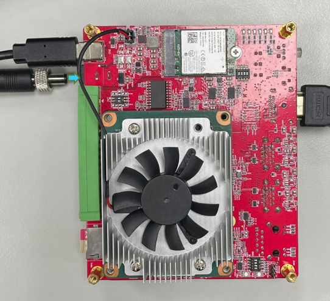   
# Booting your X261
For some detail, please refer to [Xilinx Website](https://www.xilinx.com/products/som/kria/kv260-vision-starter-kit/kv260-getting-started/booting-your-starter-kit.html). If you follow the above steps and are preparing to boot from an SD card, please switch boot option to SD card( [Refer the "Chboot" topic in utilities-intro](../2.Software/utilities-intro.md)).  

Your username would be `petalinux`.And you can set a new password at first time.

> Note: Chboot is supported starting from our BSP version 1.2.3.

# Next Steps
After booting into the system successfully, you can refer to [this](../1.Hardware/hardware.md) for more detail. Or you can run some of the examples we provide on the X261:
- [dpu-sc](../2.Software/dpu-sc.md): dpu-sc is a sample code that uses DPU instead of GPU for AI inference.
- [stesting-sc](../2.Software/stesting-sc.md): stesting-sc provide the board IO self testing, some of the io test required jigs.
- [VVAS](../2.Software/VVAS.md): VVAS(Vitis Video Analytics SDK) contains plugin developed by xilinx based on gstreamer. It can use hardware IP to accelerate image processing and AI inference in gstreamer.