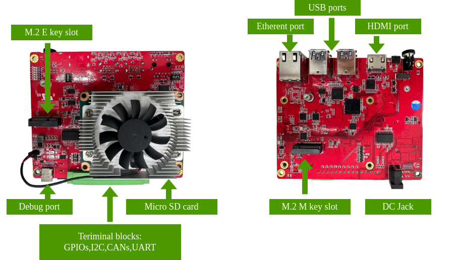
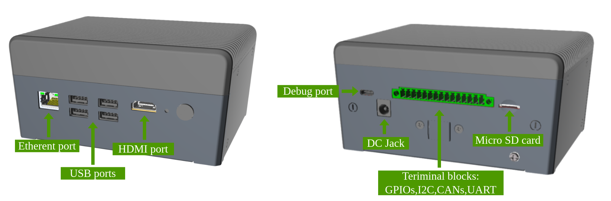
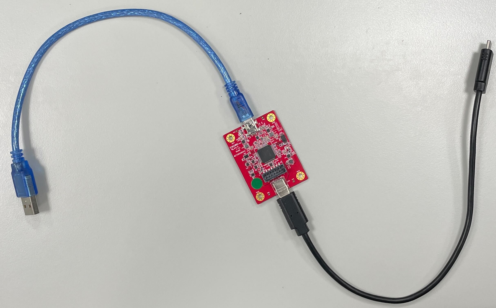
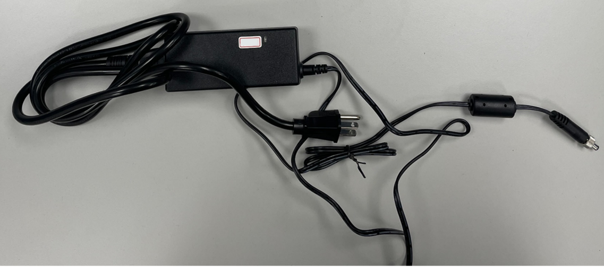
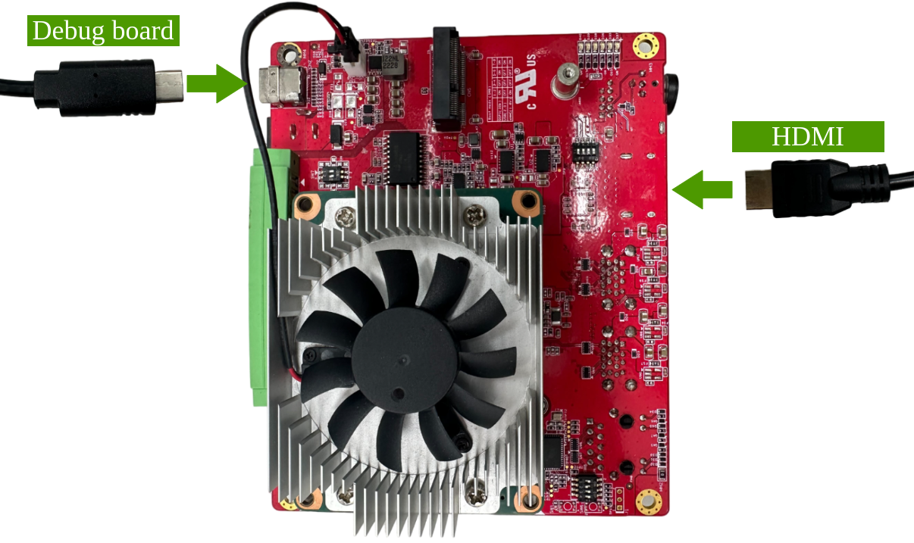
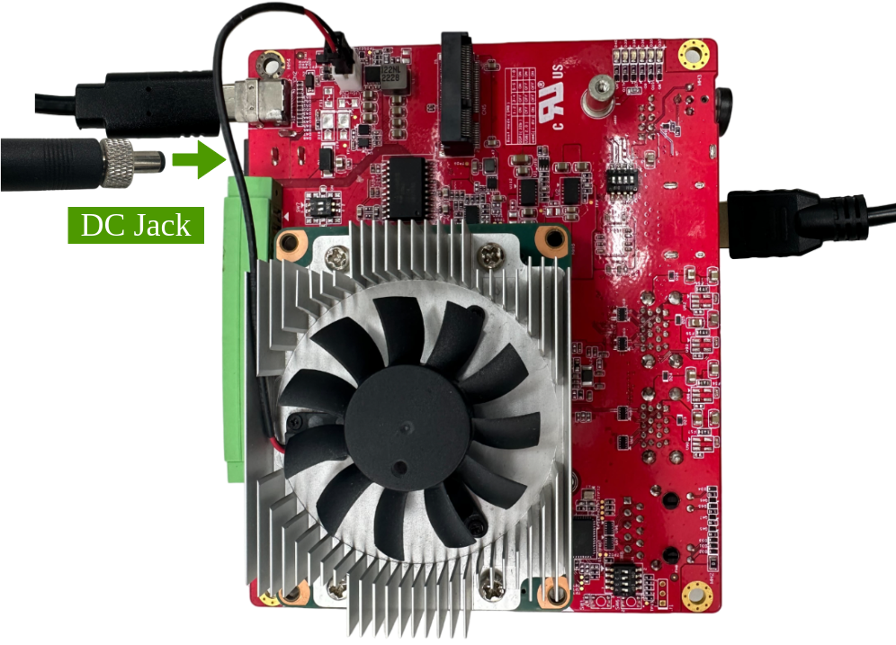
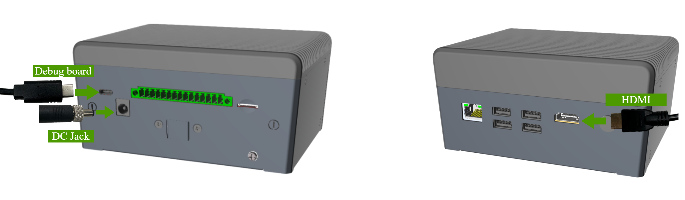

<!--
 Copyright (c) 2022 Innodisk crop.
 
 This software is released under the MIT License.
 https://opensource.org/licenses/MIT
-->
# TOC
- [Summary](#summary)
- [What you will need](#what-you-will-need)
  - [Hardware](#hardware)
  - [Software](#software)
- [Connect your X261](#connect-your-x261)
- [Booting your X261](#booting-your-x261)
- [Next Steps](#next-steps)

# Summary
The X261 currently supports two versions, EXMU-X261 and EXOU-X261. Please refer to the table below for detailed differences.

Model |	P/N | Description | Packing List
--- | --- | --- | ---
EXMU-X261 | EXMU-X261-00A1-C1 | FPGA Machine Vision Solution Kit, 0~70°C | AMD Kria K26-C SOM x1EXMU-X261 Carrier Board x1Debug Board x1Custom USB Type C to Type C Cable x1USB Type A to Micro USB Cable x1Heatsink with Fan x1
EXMU-X261	| EXMU-X261-00A1-W1	| FPGA Machine Vision Solution Kit, -40~85°C | AMD Kria K26-I SOM x1EXMU-X261 Carrier Board x1Debug Board x1Custom USB Type C to Type C Cable x1USB Type A to Micro USB Cable x1Heatsink with Fan x1
EXOU-X261	| EXOU-X261-00A1-S1 | FPGA Machine Vision Box, 0~50°C | AMD Kria K26-C SOM x1EXOU-X261 Machine Vision Box x1Debug Board x1Custom USB Type C to Type C Cable x1USB Type A to Micro USB Cable x160W Power Adapter x1US Power Cord x1
EXOU-X261	| EXOU-X261-00A1-E1 | FPGA Machine Vision Box, -30~70°C | AMD Kria K26-I SOM x1EXOU-X261 Machine Vision Box x1Debug Board x1Custom USB Type C to Type C Cable x1USB Type A to Micro USB Cable x160W Power Adapter x1US Power Cord x1

# What you will need
## Hardware
- A EXMU-X261.

- Or EXOU-X261.
 

- A Debug Board: You can use it to communicate with the host through UART.

- A Power Supply: Please prepare a power adapter of at least 12V 3A or higher

## Software
**EXMU-X261 has preloaded an image in eMMC during manufacturing.** Once you have access to the platform, you can start using it right away.

By default, the boot sequence is set to boot from the SD card then eMMC. Therefore, if no SD card is inserted, the X261 will automatically boot into the system stored in the eMMC. If needed to change the boot sequence, please refer to the [chboot tool](../2.Software/utilities-intro.md#chboot).

> Note: Chboot is supported starting from our BSP version 1.2.3.
# Connect your X261
1. Prepare a keyboard and mouse, and connect the X261 with HDMI, just like using a PC. Or, use the debug board to connect the host and use the terminal to communicate with the X261.

  > With debug board, will need to install the [FTDI driver](../4.FAQ/FAQ.md#driver-of-debug-board) on the host. The UART's bitrate of 115200 and settings of 8 data bits, no parity, 1 stop bit, and no flow control.

2. Connect power. Finally, system boot immediately after plugging in the power supply.

> If use EXOUX-261, the Connecting diagram as following.

# Booting your X261
For some detail, please refer to [Xilinx Website](https://www.xilinx.com/products/som/kria/kv260-vision-starter-kit/kv260-getting-started/booting-your-starter-kit.html).  

1. After the X261 boots up, will see a prompt to enter a username. The username for the X261 is **petalinux**
2. Next, will see a prompt to enter a **new password**. Please set a new password, and be sure to store it for future use.

> Refer to [check-system topic](./check-system.md) to troubleshoot boot problems.

# Next Steps
After booting into the system successfully, you can refer to [this](../1.Hardware/hardware.md) for more detail. Or you can run some of the examples we provide on the X261:
- [pre-build-image](../0.Getting-Started/pre-build-image.md): use pre-built image to intuitively experience the potency of employing AI solutions on the platform.
- [dpu-sc](../2.Software/dpu-sc.md): dpu-sc is a sample code that uses DPU instead of GPU for AI inference.
- [stesting-sc](../2.Software/stesting-sc.md): stesting-sc provide the board IO self testing, some of the io test required jigs.