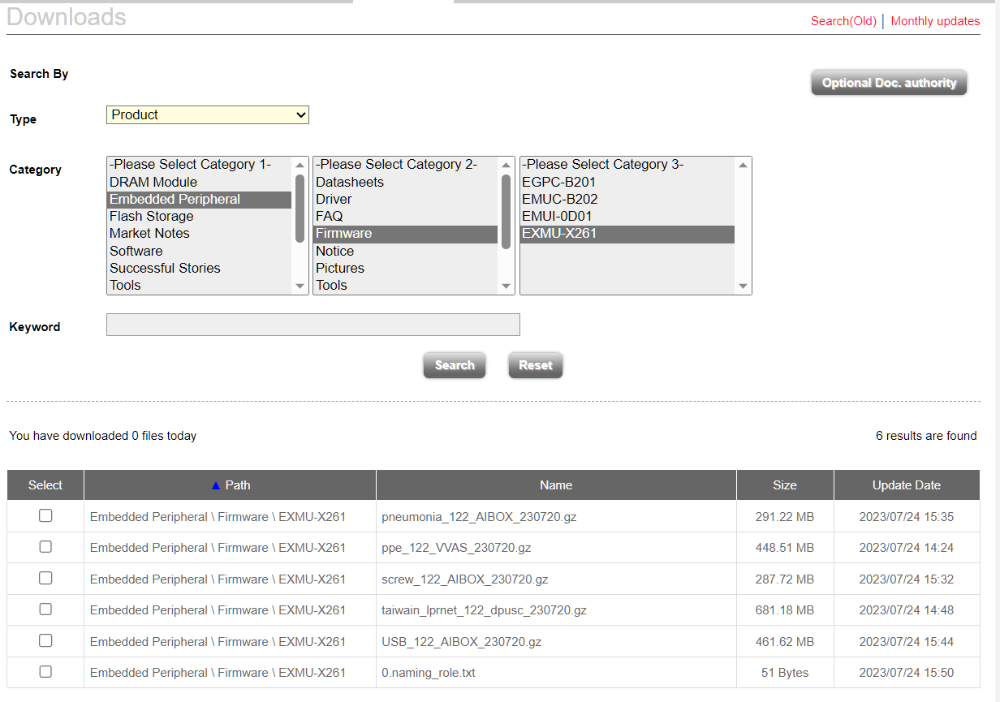
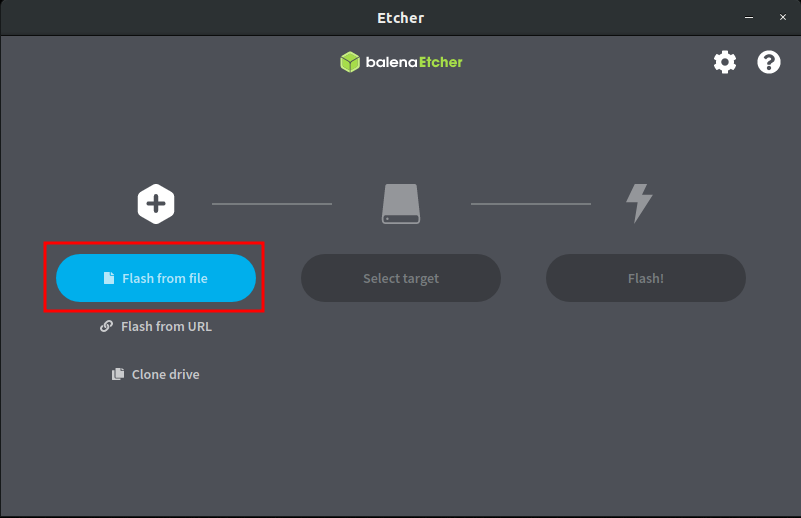
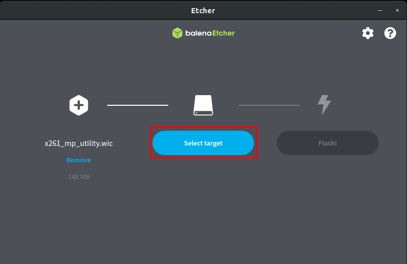
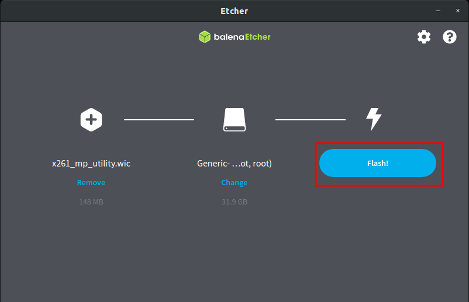
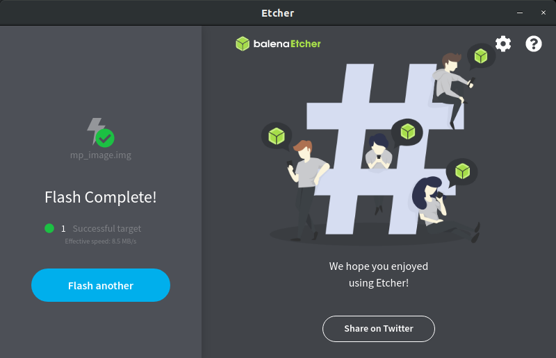
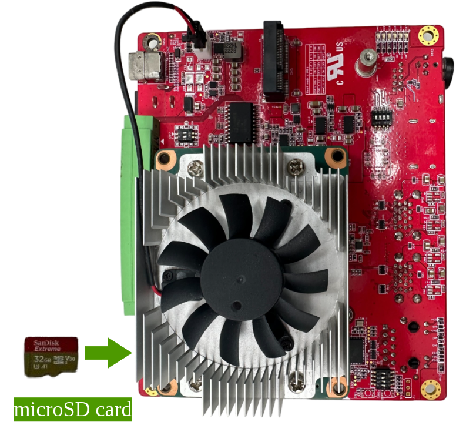

# TOC
- [Overview](#overview)
- [Pre-build image](#pre-build-image)
- [Setting up the SD Card Image](#setting-up-the-sd-card-image)
- [Boot with pre-build image](#boot-with-pre-build-image)

# Overview
Pre-built image automatically run video real-time detection after powering on. UVCCAM_122_VVAS can also perform real-time detection through a connected webcam in addition to video. Recommended to start by using UVCCAM_122_VVAS image.

If you decide to use our pre-built image. Please contact james_chen@innodisk.com. We will provide you with a [myinnodisk](https://myinnodisk.innodisk.com/myinnodisk/Login.aspx) account. Once inside, you will see as the following. And you can download the pre-built image you want.
 

Next, please prepare an SD card and follow the step to flash the pre-built image onto the SD card. [Setting up the SD Card Image](#setting-up-the-sd-card-image). 

Final, following the step to boot the X261 for AI solution.

# Pre-build image

Image | Description | Reference 
--- | --- | ---
USB_122_AIBOX_230720.gz | This is a solution used on a conveyor belt to detect defects in USB pendrive assembly. Correctly assembled USBs are marked as 'pass,' while incorrectly assembled ones are marked as 'failed.   Input: video  Output: HDMI   AI model: object detection  | [Defect dection](../5.Case-study/Defect-Detection.md) 
pneumonia_122_AIBOX_230720.gz | Pneumonia(lung lesion) detection, used in medical X-ray examinations to detect lung lesions. If any lesions are found in the patient's lung X-ray, they will be highlighted to assist doctors in interpreting the X-ray images.  Input: video  Output: HDMI   AI model: object detection   | [Defect dection](../5.Case-study/Defect-Detection.md) 
screw_122_AIBOX_230720.gz | This is a solution used in factories to detect defects of screws. If any defects are found, they will be highlighted immediately.  Input: video  Output: HDMI   AI model: object detection | [Defect dection](../5.Case-study/Defect-Detection.md) 
taiwain_lprnet_122_dpusc_230720.gz | Taiwain ANPR(Automatic number-plate recognition), recognize Taiwanese license plates, clearly identifying the location of the plate and interpreting the license plate number.  Input: video  Output: HDMI   AI model: object detection, LPRNet  | [ANPR ](../3.POC/ANPR.md) 
ppe_122_VVAS_230720.gz | PPE(Personal Protective Equipment),verifies whether workers are correctly wearing their equipment. Run four AI models at same time and display four result in single screen  Input: video  Output: HDMI   AI model: object detection  | [VVAS ](../3.POC/VVAS-Demo.md) 
UVCCAM_122_VVAS_230808.gz | This is an object detection using the COCO dataset. Before powering on, you can connect a webcam. When the system detects the webcam after booting, it will automatically switch to real-time mode. If no camera is detected, it will use a default video for inference.  Input: video  Output: HDMI   AI model: object detection  **Recommended to start by using this pre-build image**. | [VVAS ](../3.POC/VVAS-Demo.md) 

The pre-build image naming rule can refer [here]((../4.FAQ/FAQ.md#pre-build-image-naming-rule)).
# Setting up the SD Card Image

You will need a computer(host) to prepare the system for use on X261. Here we will introduce writing the system to the microSD card, and then no matter whether the operating system you are using is Windows or Linux, you can use the following flow normally.
**Please prepare a microSD card of 16GB or more.** 

1. Download the `pre-build image` (please contact james_chen@innodisk.com) to your computer.
2. Flash the image file to the microSD card according to the following instructions:
   1. Download and launch [Etcher](https://www.balena.io/etcher/).
   2. Select the image file to use.  
   
   1. Please insert the microSD card into your computer, then select the microSD Card to use.  
     
   1. After clicking “Flash!”, it will take about 10-20 minutes.  
     
   1. Done!  
     
   1. Finally, please safely remove your SD card.  
# Boot with pre-build image
1. Please ensure that the X261 is powered off and the pre-built image and successfully flashed in the microSD card.How to flash the microSD card, please refer [Setting up the SD Card Image](#setting-up-the-sd-card-image)
2. Insert the microSD card containing the X261 image in the microSD card slot.  
  
3. Prepare a keyboard and mouse, and connect the X261 with HDMI.
.   
4. Connect power. Finally, system boot immediately after plugging in the power supply.

5. The AI solution will be displayed directly on the screen.
 
