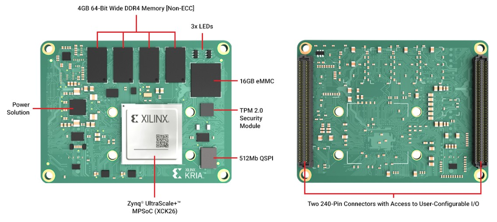
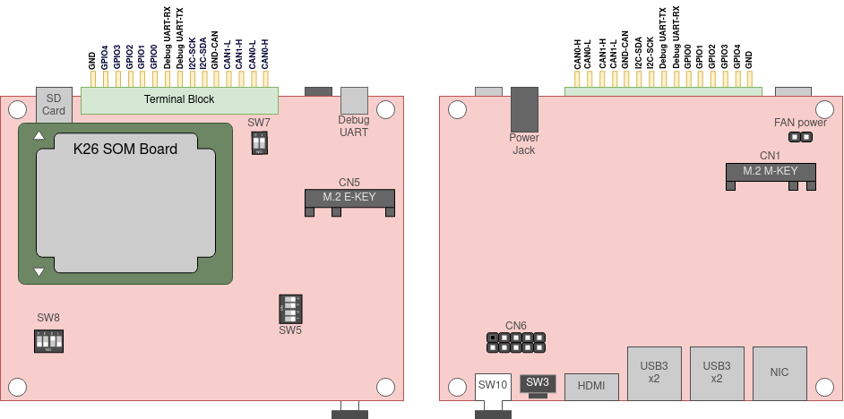
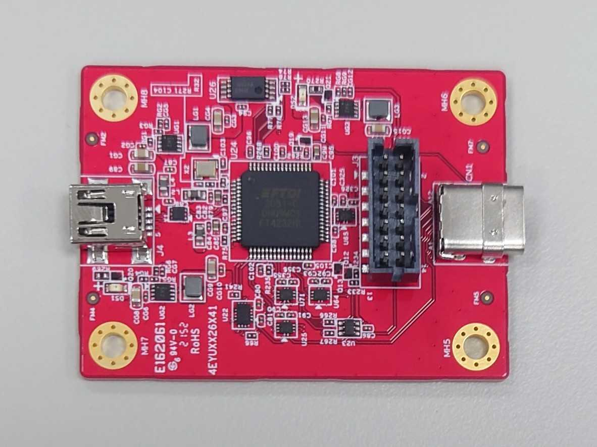

<!--
 Copyright (c) 2022 Innodisk crop.
 
 This software is released under the MIT License.
 https://opensource.org/licenses/MIT
-->

- [SOM Board Overview](#som-board-overview)
- [Devices on SOM](#devices-on-som)
  - [QSPI Flash](#qspi-flash)
  - [EMMC](#emmc)
  - [DDR4](#ddr4)
  - [TPM2.0 Security Module](#tpm20-security-module)
  - [SOC](#soc)
    - [Processing System (PS)](#processing-system-ps)
    - [Programmable Logic (PL)](#programmable-logic-pl)
- [Carrier Board Overview](#carrier-board-overview)
- [IO on Carrier Board](#io-on-carrier-board)
  - [Processing System (PS)](#processing-system-ps-1)
  - [Programmable Logic (PL)](#programmable-logic-pl-1)
- [Switchs on Carrier Board](#switchs-on-carrier-board)
  - [SW3 & SW6](#sw3--sw6)
  - [SW4(LED)](#sw4led)
  - [SW5](#sw5)
    - [SW5-1,2,4](#sw5-124)
    - [SW5-3](#sw5-3)
  - [SW7](#sw7)
  - [SW8](#sw8)
- [Jumpers on Carrier Board](#jumpers-on-carrier-board)
  - [Fan power](#fan-power)
  - [J22 & J23](#j22--j23)
  - [J24](#j24)
  - [J25](#j25)
  - [J26](#j26)
- [Debug board](#debug-board)
  - [Debug UART](#debug-uart)
  - [JTAG](#jtag)
  - [HDMI UART](#hdmi-uart)

# SOM Board Overview

# Devices on SOM
## QSPI Flash
- Size : 512MB  
    Storage for boot firmware which file name is `BOOT.BIN`.

## EMMC
- Size : 16GB  
    Storage for Images, there should be two partition `boot` and `root` in EMMC.

## DDR4
- Size : 4GB
- Speed : DDR4_2400R 

## TPM2.0 Security Module
- Vendor :　infineon

## SOC
- Part Name :  xck26-sfvc784-2lv-c 
- Zynq UltraScale+  
    This series FPGA are also called as `zynqmp`. It contain two main part:
### Processing System (PS)
- CPU CortexA53 * 4
- GPU Mali400
- IO (MIO)
### Programmable Logic (PL)
- Video codec (VCU)
- Logic gates
- IO (EMIO)

# Carrier Board Overview

# IO on Carrier Board
There are two types of IO PS & PL on carrier board, IO which from PS will be always avalible, but IO which from PL will be only avalible when FPGA with firmware include this IO.
## Processing System (PS)
- LAN
- USB
- HDMI
- SD Card
- EMMC
- UART0
- M.2 AKEY PCIE Gen2x1
## Programmable Logic (PL)
- M.2 MKEY PCIE Gen3x4
- CAN0
- CAN1
- GPIO
- I2C

# Switchs on Carrier Board
This section introduce the function of switchs which on [the baord](#carrier-board-overview).
## SW3 & SW6
- Function : Hardware reset.

## SW4(LED)
- Function : Power button on when SW5-3 switch to ON.

## SW5
### SW5-1,2,4
- Function : IO voltage Level switch, default off for 1.8V.
### SW5-3
- Function : Power button on switch, default off for auto power on. 

## SW7
- Function : CAN BUS Terminal resistor(120ohm) switch. SW7[1] for CAN0, SW7[2] for CAN1.

## SW8
- Function : Boot Mode selector, default Boot Mode is Quad-SPI (32b).

    Boot Mode | SW8 [1:4]
    ---|---
    PS JTAG | 1111
    Quad-SPI (32b) | 1011

# Jumpers on Carrier Board
This section introduce the function of jumpers which on [the baord](#carrier-board-overview).
## Fan power
- Function : 12V & GND.

## J22 & J23
- Function : I2C for flashing clock generator.

## J24
- Function : Hardware power-on.

## J25
- Function : Hardware reset.

## J26
- Function : 5V & GND.

# Debug board

Debug Board include three main function:
- Debug UART
- JTAG
- HDMI UART
## Debug UART
- Baud rate : 115200
- Function : Main interactive interface for developer, it could be access by serial port utilities like minicom, putty, mobaxterm.
  
## JTAG
JTAG wont work if EEPROM on debug board didn't contain correct info.
- Function : JTAG for xilinx IDE.

## HDMI UART
Direct connect into HDMI splitter which on carrier board.
- Baud rate : 115200
- Function : Flash firmware for HDMI splitter.
