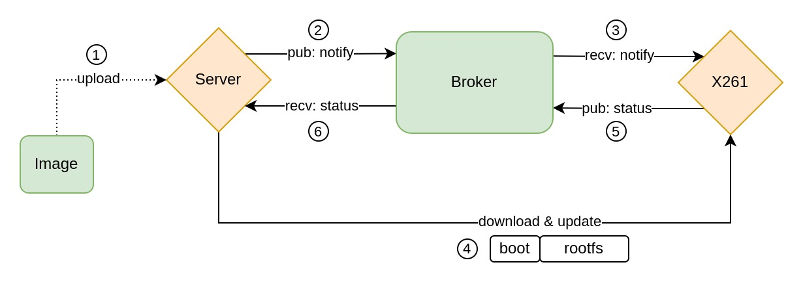
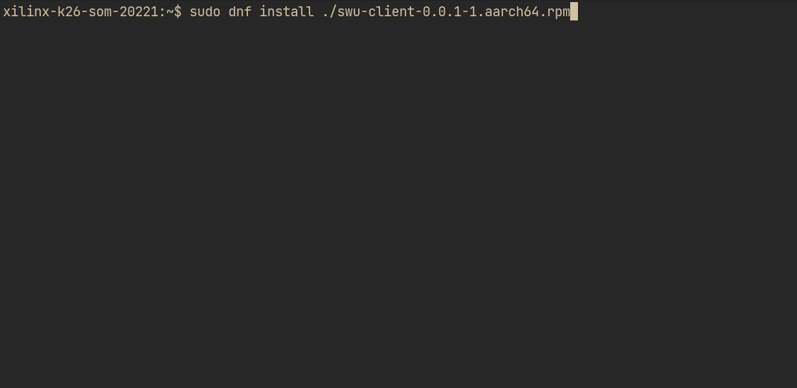
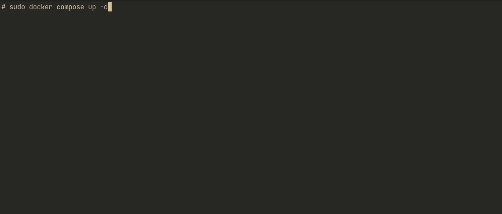
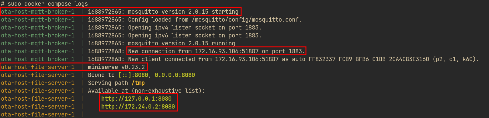
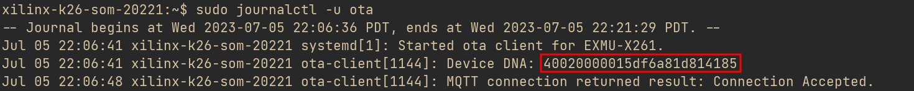
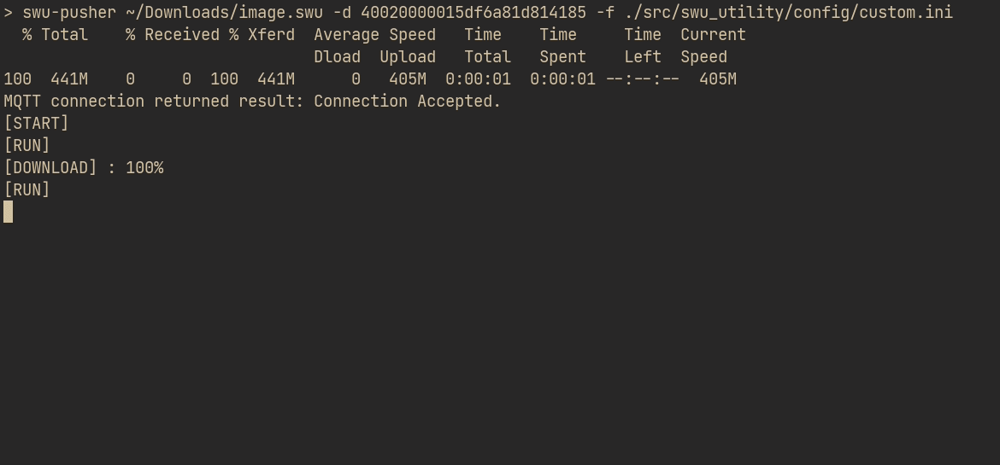
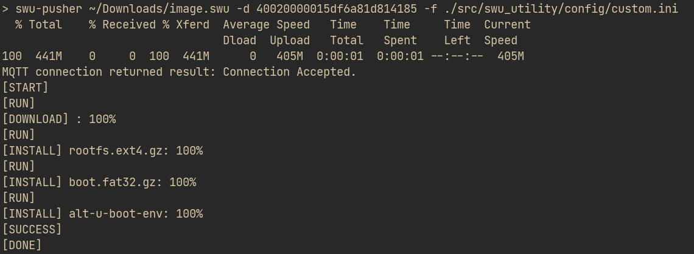
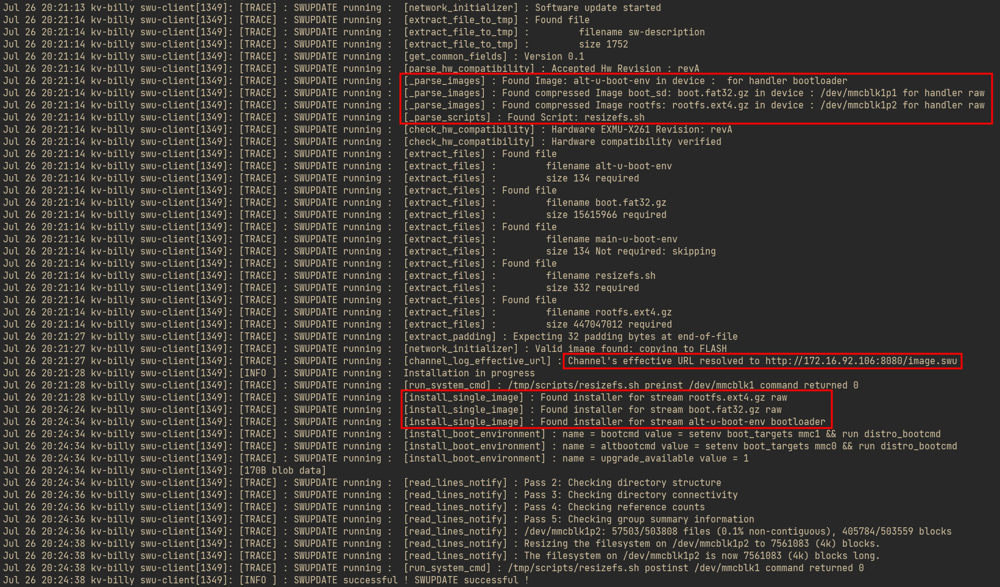
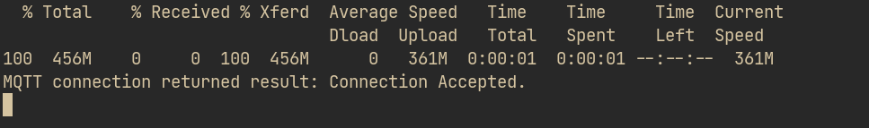

# Overview

We provide Image-based Over-the-Air update on EXMU-X261. One can use our toolings and images to update your EXMU-X261.



# TOC
- [Overview](#overview)
- [Prerequisites](#prerequisites)
- [Prepare for OTA](#prepare-for-ota)
    - [On EXMU-X261: install `swu-client` service](#on-exmu-x261-install-swu-client-service)
    - [On host machine: install `swu-pusher` and run OTA server](#on-host-machine-install-swu-pusher-and-run-ota-server)
    - [Custom configuration file](#custom-configuration-file)
- [Start OTA](#start-ota)
- [FAQ](#faq)

# Prerequisites

1. a host machine connected to your EXMU-X261 through a network
2. [Docker](https://docs.docker.com/engine/install/ubuntu/) installed on your host machine
3. an OTA image stored on your host machine 

# Prepare for OTA

## On EXMU-X261: install `swu-client` service

1. Install the RPM package.

    ```bash
    wget https://raw.githubusercontent.com/InnoIPA/EXMU-X261-swu-utility/main/rpm/release-0.0.1/swu-client-0.0.1-1.aarch64.rpm
    ```

    ```bash
    sudo dnf install ./swu-client-0.0.1-1.aarch64.rpm
    ```

    <details>
    <summary>Output messages</summary>

    

    </details>


## On host machine: install `swu-pusher` and run OTA server

1.  Clone EXMU-X261-swu-utility repo.

    ```bash
    git clone https://github.com/InnoIPA/EXMU-X261-swu-utility
    ```

2. Install `swu-pusher`.

    ```bash
    cd EXMU-X261-swu-utility
    pip3 install ./
    ```

3. Run OTA server.

    ```bash
    cd docker
    sudo docker compose up -d
    ```

    

    To verify whether services are running, execute `sudo docker compose logs`.

    


## Custom configuration file

Both `swu-client` service running on EXMU-X261 and `swu-pusher` need configuration files.
Two [examples](https://github.com/InnoIPA/EXMU-X261-swu-utility/tree/main/src/swu_utility/config) are included in our repo.
We are now going to create a custom configuration file from `local.ini`.

- the content of `local.ini`

    ```
    [broker]
    host = localhost
    port = 1883

    [file server]
    host = localhost
    port = 8080
    ```


**Note:** In the following section, we assume IP addresses of your host machine and EXMU-X261 are 192.168.0.1 and 192.168.0.2 respectively.

1. `cd` into our EXMU-X261-swu-utility repo.

    ```bash
    cd EXMU-X261-swu-utility
    ```

2. Make a copy of `local.ini`, and rename it to `custom.ini`. 

    ```bash
    cp ./src/swu_utility/config/{local.ini,custom.ini}

    ```

3. Substitute `localhost` into your host machine’s IP, in this case, 192.168.0.1.

    ```bash
    sed -i 's/localhost/192.168.0.1/' ./src/swu_utility/config/custom.ini
    ```

4. Copy `custom.ini` to EXMU-X261 and restart `swu-client` service.

    ```bash
    scp ./src/swu_utility/config/custom.ini petalinux@192.168.0.2:~/config.ini
    ```

    ```bash
    ssh -t petalinux@192.168.0.2 'sudo mv ~/config.ini /opt/innodisk/swu_utility'
    ```

    ```bash
    ssh -t petalinux@192.168.0.2 'sudo systemctl restart swu-client'
    ```

    **Note:** You may need to type petalinux’s password twice, one for `ssh` and another for `sudo`.


# Start OTA

1. Find out DNA of your EXMU-X261.

    Execute `journalctl` on EXMU-X261 and look for the line containing "Device DNA".

    ```bash
    sudo journalctl -f -u swu-client
    ```

    

2. To trigger the OTA, execute `swu-pusher` on the host machine 
    - the usage of `swu-pusher`

        ```bash
        suw-pusher <path to a image file> -d <dna> -f <path to a config file>
        ```

    - e.g.

        ```bash
        # inside our EXMU-X261-swu-utility repo
        swu-pusher ~/Downloads/image.swu -d 40020000015df6a81d814185 -f ./src/swu_utility/config/custom.ini
        ```

        

        

        <details>
        <summary>A more detailed log on EXMU-X261</summary>

        

        </details>


# FAQ

1. After executing `swu-pusher`, no progress status was outputed.

    

    Make sure `swu-client` service is running. Execute `sudo systemctl status swu-client` on EXMU-X261 to verify that `suw-client` service is indeed running. If not, execute `sudo systemctl start swu-client` to start the service. 

2. What if an update failed?

    To see why an update failed, execute `sudo journalctl -u swu-client` to see logs.
