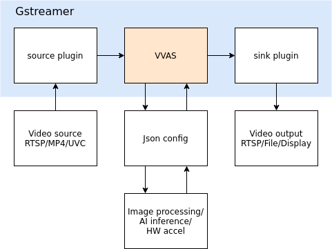
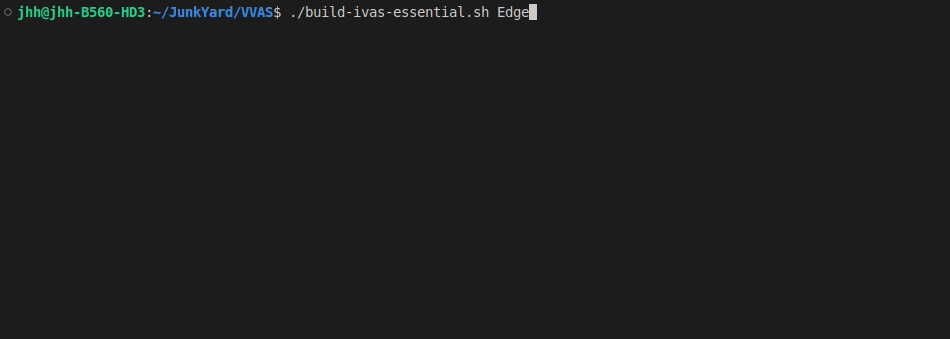

<!--
 Copyright (c) 2022 Innodisk crop.
 
 This software is released under the MIT License.
 https://opensource.org/licenses/MIT
-->

- [Overview](#overview)
- [How to Install](#how-to-install)
  - [Install by RPM](#install-by-rpm)
  - [Manually install](#manually-install)
- [reference](#reference)

# Overview
VVAS(Vitis Video Analytics SDK) contains plugin developed by xilinx based on gstreamer. It can use hardware IP to accelerate image processing and AI inference in gstreamer. The overall architecture is as shown in the figure below. The video source is opened by gstreamer plugin and passed to VVAS for image processing and AI computing. The corresponding accelerator application is linked to VVAS according to Json config.  


# How to Install
Following install process are using Vitis ai 1.4 and VVAS 1.0 for example. Change the version of VVAS by table below, if using different vesion of Vitis ai.
 Vitis ai version | VVAS version
 --- | --- 
 1.4 | 1.0 
 2.0 | 1.1 
 2.5 | 2.0 

## Install by RPM
VVAS can be installed by using the prebuilt rpm package.  
```
rpm -ivh --force vvas-0.1-1.aarch64.rpm
```

## Manually install
If you are using customised BSP, there may have dependency issue. So we will suggest manually install rather than install by RPM(Red Hat Package Manager).
- Preparation
    Petalinux sdk including Vitis ai, opencv (over 4.4), jansson.
    
1. Download source code which match to your Vitis ai version on x86 host.
    
    ```bash
    git clone -b VVAS_REL_v1.0 https://github.com/Xilinx/VVAS.git
    ```
2. Source petalinux sdk.
    
    ```bash
    unset LD_LIBRARY_PATH
    source <path-to-sdk>/environment-setup-aarch64-xilinx-linux
    ```
    
3. Build vvas on x86 host.
    
    ```bash
    chmod 755 build-ivas-essential.sh
    ./build-ivas-essential.sh Edge
    ```
    
    
4. Copy the result from x86 host into rootfs of k26.
    
    ```bash
    scp ./install/ivas_installer.tar.gz petalinux@<IP>:/
    ```
    
5. Install the vvas on k26.
    
    ```bash
    cd /
    sudo tar -xvf ivas_installer.tar.gz
    ```

# reference
[Xilinx VVAS](https://www.xilinx.com/products/design-tools/vitis/vvas.html)  
[Xilinx VVAS github](https://github.com/Xilinx/VVAS.git)  
[Xilinx VVAS tutorial](https://xilinx.github.io/VVAS/1.0/build/html/index.html)  