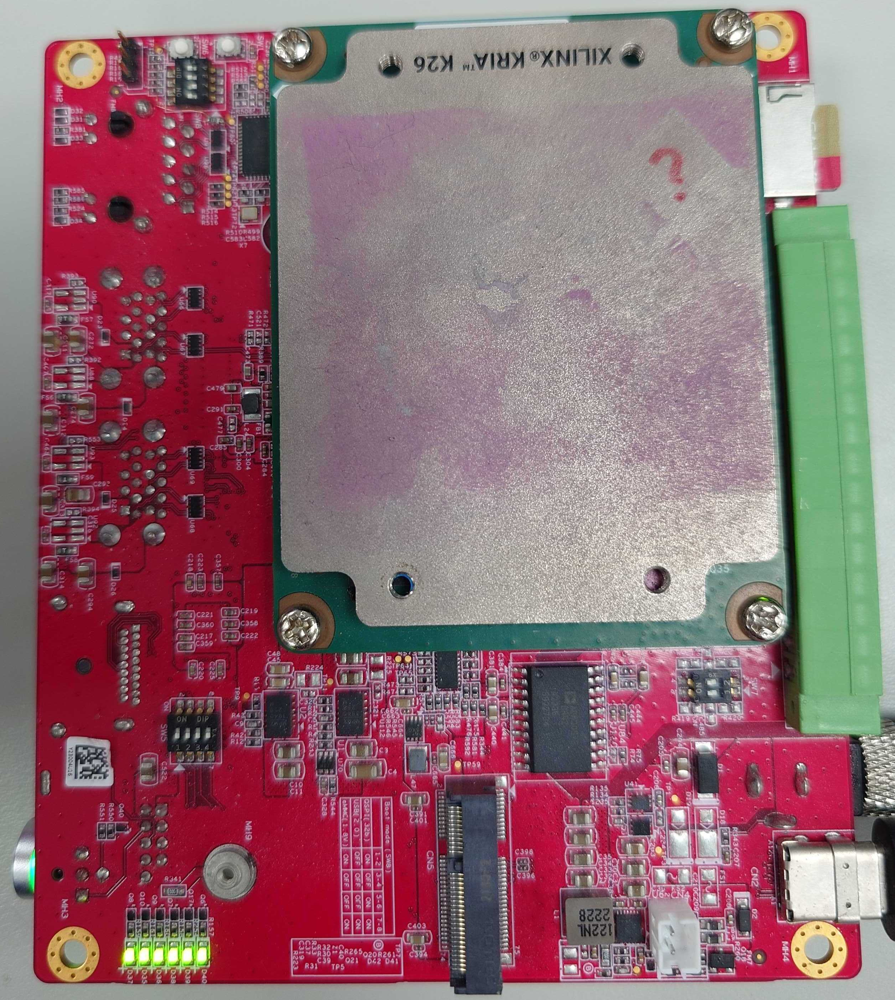

<!--
 Copyright (c) 2024 innodisk Crop.
 
 This software is released under the MIT License.
 https://opensource.org/licenses/MIT
-->

# TOC
- [TOC](#toc)
- [Overview](#overview)
- [Check power](#check-power)
- [Check I/O fucntion](#check-io-fucntion)
- [Check PL fucntion](#check-pl-fucntion)

# Overview

# Check power
The 6 led on carrier board should be always on.


# Check I/O fucntion
[Stesting](https://github.com/InnoIPA/stesting-sc) is a public repository that provide the board IO self testing.  
Refer to the board info with [this page](https://github.com/InnoIPA/EXMU-X261-usermanual/tree/main/tocs/1.Hardware).

# Check PL fucntion
There will be several IPs on the PL of loaded application for x261, fuctions of each IP are different.

For example default loaded application for x261 has following IPs, here are the test commands:
1. PCIE root complex
   - IO can be test by `stesting` in section [Check I/O fucntion](#check-io-fucntion).
2. DPU
    - Test Command - Check the DPU kernel status.
        ```bash
        sudo xdputil query
        ```
    - Correct Result - It shows that `kernels` section contain a DPU.
        ```json
        {
            "DPU IP Spec":{
                "DPU Core Count":1,
                "IP version":"v4.0.0",
                "generation timestamp":"2022-05-14 14-30-00",
                "git commit id":"4772d51",
                "git commit time":2022051323,
                "regmap":"1to1 version"
            },
            "VAI Version":{
                "libvart-runner.so":"Xilinx vart-runner Version: 2.5.0-c26eae36f034d5a2f9b2a7bfe816b8c43311a4f8  2024-05-23-04:35:55 ",
                "libvitis_ai_library-dpu_task.so":"Xilinx vitis_ai_library dpu_task Version: 2.5.0-c26eae36f034d5a2f9b2a7bfe816b8c43311a4f8  2022-06-15 07:33:00 [UTC] ",
                "libxir.so":"Xilinx xir Version: xir-c26eae36f034d5a2f9b2a7bfe816b8c43311a4f8 2024-05-23-03:51:26",
                "target_factory":"target-factory.2.5.0 c26eae36f034d5a2f9b2a7bfe816b8c43311a4f8"
            },
            "kernels":[
                {
                    "DPU Arch":"DPUCZDX8G_ISA1_B3136",
                    "DPU Frequency (MHz)":200,
                    "IP Type":"DPU",
                    "Load Parallel":2,
                    "Load augmentation":"enable",
                    "Load minus mean":"disable",
                    "Save Parallel":2,
                    "XRT Frequency (MHz)":200,
                    "cu_addr":"0xa0000000",
                    "cu_handle":"0xaaaae5359190",
                    "cu_idx":0,
                    "cu_mask":1,
                    "cu_name":"DPUCZDX8G:DPUCZDX8G_1",
                    "device_id":0,
                    "fingerprint":"0x101000016010406",
                    "name":"DPU Core 0"
                }
            ]
        }
        ```
3. AXI_DNA
    - Test Command - Get the `DNA` of FPGA by using `stesting`.
        ```bash
        sudo stesting -dq
        ```
    - Correct Result - `DNA` shows on `FPGADNA` section likes `400200000150????????????`.
        ```bash
        INVALID TEST MODE
        =======================================
        =     TEST ENVIROMENT INFORMATION     =
        =======================================
            BOARDNAME : EXMU-X261
            COMPILETIME : Jul 11 2023,14:49:48
            VERSION : v0.0.6
            TESTDATE : 5 27 2024,22:11:42
            TESTMODE : debug_pipline
            FPGADNA : 400200000150792634710085
        =======================================
        =           IO TEST RESULT            =
        =======================================
        =======================================
                   ____  ___   __________      
                  / __ \/   | / ___/ ___/      
                 / /_/ / /| | \__ \__  \       
                / ____/ ___ |___/ /__/ /       
               /_/   /_/  |_/____/____/        

        =======================================
        ```
4. VCU
   - Command - Gstreamer vcu loop back test.
        ```bash
        gst-launch-1.0 \
        videotestsrc ! video/x-raw, width=1920, height=1080 \
        ! videoconvert \
        ! omxh264enc target-bitrate=2000 control-rate=2 \
        ! h264parse ! omxh264dec \
        ! identity eos-after=60 \
        ! fakesink
        ```
   - Result - End without any error message.
        ```bash
        Setting pipeline to PAUSED ...
        Pipeline is PREROLLING ...
        Redistribute latency...
        !! Warning: Adapting profile to support bitdepth and chroma mode
        !! The specified Level is too low and will be adjusted !!
        Redistribute latency...
        Pipeline is PREROLLED ...
        Setting pipeline to PLAYING ...
        New clock: GstSystemClock
        Got EOS from element "pipeline0".
        Execution ended after 0:00:01.219278146
        Setting pipeline to NULL ...
        Freeing pipeline ...
        ```
