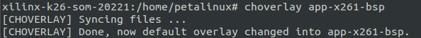
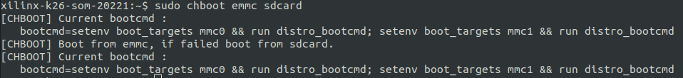

<!--
 Copyright (c) 2023 innodisk Crop.
 
 This software is released under the MIT License.
 https://opensource.org/licenses/MIT
-->

# TOC
- [Overview](#overview)
- [Choverlay](#choverlay)
- [Chboot](#chboot)
- [FAQ](#faq)

# Overview
This page introduce the simple utilities on EXMU-X261 that enhance the user expericence. 


# Choverlay
- Choverlay is a simple utility that based on shell script, it can change the default loadapp of during the boot process.
- Usage:
    ```bash
    sudo choverlay <name-of-overlay-app>
    ```
- Example:
    ```bash
    sudo choverlay app-x261-aibox
    sudo choverlay app-x261-bsp
    ```
- Result:  

# Chboot
- Chboot is a simple utility that based on shell script, it can change the default boot partition between external SDcard and EMMC which on som board.
- Usage:  
    ```bash
    sudo chboot <default-boot-from> <if-failed-boot-from>
    ```
- Example:
    ```bash
   sudo chboot sdcard
   sudo chboot emmc
   sudo chboot sdcard emmc
   sudo chboot emmc sdcard
    ```
- Result:


# FAQ
- Why there are two verible with `chboot`?  
  The second verible is an optional verible. It is for preventing boot failed with default boot part, if failed system will boot from another boot part according to the second verible.