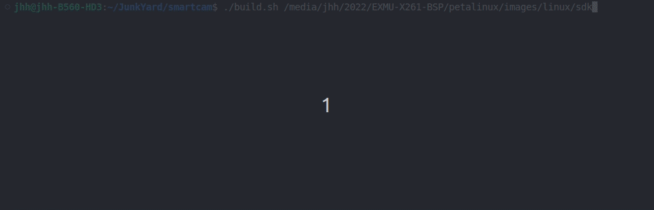
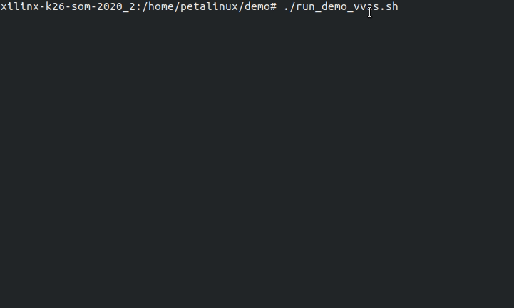

<!--
 Copyright (c) 2022 Innodisk crop.
 
 This software is released under the MIT License.
 https://opensource.org/licenses/MIT
-->

- [Overview](#overview)
- [How to Install](#how-to-install)
  - [VVAS](#vvas)
  - [Xilinx smartcam](#xilinx-smartcam)
    - [Install by RPM](#install-by-rpm)
    - [Manually install](#manually-install)
  - [Innodisk demo](#innodisk-demo)
    - [Install by RPM](#install-by-rpm-1)
- [How to run](#how-to-run)
- [Reference](#reference)

# Overview
This tutorial tells to run the innodisk VVAS demo.

For runnning the innodisk VVAS demo, you will need three parts:
- VVAS  
  Vitis Video Analytics SDK.
- Xilinx smartcam  
  We will use the library of Xilinx smartcam to draw the result of AI inference.
- Innodisk demo  
  Contains example files for innodisk VVAS demo.

# How to Install
Following install process are using Vitis ai 1.4 and VVAS 1.0 for example. Change the version of VVAS by table below, if using different vesion of Vitis ai.
 Vitis ai version | VVAS version
 --- | --- 
 1.4 | 1.0 
 2.0 | 1.1 
 2.5 | 2.0 

`If you are using customised BSP, there may have dependency issue. So we will suggest manually install rather than install by RPM(Red Hat Package Manager).`
## VVAS
Please check out [this page](../2.Software/VVAS.md).
## Xilinx smartcam
We will use the library of Xilinx smartcam to draw the result of AI inference.
### Install by RPM
```
rpm -ivh --force smartcam-1.0.1-1.aarch64.rpm
```
### Manually install
- Preparation
    Petalinux sdk including Vitis ai, opencv (over 4.4), jansson.
1. Download source code.
    
    ```bash
    git clone https://github.com/Xilinx/smartcam.git
    cd smartcam
    ```
    
2. Source petalinux sdk.
    
    ```bash
    unset LD_LIBRARY_PATH
    source <path-to-sdk>/environment-setup-aarch64-xilinx-linux
    ```
    
3. Fix the `build.sh` as below:
    
    ```bash
    #! /bin/sh
    
    sdkdir=${1}
    conf=${2:-Release}
    
    # unset LD_LIBRARY_PATH;
    # source ${sdkdir}/environment-setup-*;
    mkdir -p build
    cd build
    cmake -DCMAKE_BUILD_TYPE=${conf} -DCMAKE_TOOLCHAIN_FILE=${sdkdir}/sysroots/x86_64-petalinux-linux/usr/share/cmake/OEToolchainConfig.cmake ../ && make -j && make package
    cd ..
    ```
    
4. Build the project.
    
    ```bash
    chmod 755 ./build.sh
    ./build.sh <path-to-sdk>
    ```
    
    if shows error message as below:
    ```
    ERROR: missing libcorrespondence.a
    ```
    Follow [this post](https://support.xilinx.com/s/question/0D52E00006mEc4wSAC/building-smartcam-app-error-missing-libcorrespondencea-?language=en_US) of xilinx forum will fix the issue.
    
5. Copy the .rpm file from x86 host to the rootfs of k26.
6. Install the .rpm file on k26.
    
    ```bash
    rpm -ivh --force smartcam-1.0.1-1.aarch64.rpm
    ```
## Innodisk demo
- Preparation
    Install the VVAS and xilinx smartcam by following previous section.
### Install by RPM
```
rpm -ivh --force vvas_demo-0.1-1.aarch64.rpm
```

# How to run
- Preparation
    Plug the HDMI port of carrier board to a screen.

1. Update FPGA application.
    
    ```bash
    xmutil unloadapp
    xmutil loadapp kv260-aibox-reid
    ```
    
2. Excute the script from Innodisk demo.
    
    ```bash
    cd ~/demo
    # basic vvas demo
    sudo ./run_demo_vvas.sh
    # vvas demo including uvc camera with face detection
    sudo ./run_demo_vvas_cam.sh
    ```
    The console will hang at `New clock: ...` as below:
    
3. The screen should shows result as below:
   


# Reference

[Multichannel ML](https://xilinx.github.io/VVAS/main/build/html/docs/Embedded/Tutorials/MultiChannelML.html)

[GitHub - Xilinx/VVAS: Vitis Video Analytics SDK](https://github.com/Xilinx/VVAS)

[GitHub - Xilinx/smartcam](https://github.com/Xilinx/smartcam)

[GitHub - Xilinx/aibox-reid](https://github.com/Xilinx/aibox-reid)