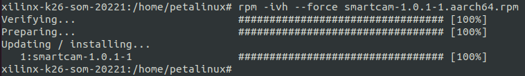

<!--
 Copyright (c) 2022 Innodisk crop.
 
 This software is released under the MIT License.
 https://opensource.org/licenses/MIT
-->

# TOC
- [Overview](#overview)
- [How to Install](#how-to-install)
  - [VVAS](#vvas)
  - [Xilinx smartcam \& aibox-reid](#xilinx-smartcam--aibox-reid)
    - [Build \& Install](#build--install)
  - [Innodisk demo](#innodisk-demo)
    - [Install by RPM](#install-by-rpm)
  - [FPGA FW (application)](#fpga-fw-application)
- [How to run](#how-to-run)
  - [Preparation](#preparation)
  - [run](#run)
- [DEMO](#demo)
  - [Computex taipei, 2023](#computex-taipei-2023)
- [Report](#report)
- [Reference](#reference)

# Overview
This tutorial tells to run the innodisk VVAS demo.

For runnning the innodisk VVAS demo, you will need three parts:
- VVAS  
  Vitis Video Analytics SDK.
- Xilinx smartcam  
  We will use the library of Xilinx smartcam to draw the result of AI inference.
- Innodisk demo  
  Contains example files for innodisk VVAS demo.

# How to Install
## VVAS
- VVAS 2.0 is default built-in with the system, check out [this page](../2.Software/VVAS.md) if user needs to build VVAS manually.
## Xilinx smartcam & aibox-reid
- This demo will use the library of Xilinx smartcam and aibox-reid to draw the result of AI inference and using the preprocessing IP.
- Following process is using smartcam as example, remember to install aibox-reid as well.

### Build & Install
- Preparation
    Petalinux sdk including Vitis ai, opencv (over 4.4), jansson.
1. Download source code.
    
    ```bash
    git clone https://github.com/Xilinx/smartcam.git
    cd smartcam
    ```
    
2. Source petalinux sdk.
    
    ```bash
    unset LD_LIBRARY_PATH
    source <path-to-sdk>/environment-setup-aarch64-xilinx-linux
    ```

3. Build the project.
    
    ```bash
    chmod 755 ./build.sh
    ./build.sh <path-to-sdk>
    ```
    
    If shows error message as below:
    ```
    ERROR: missing libcorrespondence.a
    ```
    Follow [this post](https://support.xilinx.com/s/question/0D52E00006mEc4wSAC/building-smartcam-app-error-missing-libcorrespondencea-?language=en_US) of xilinx forum will fix the issue.
    
4. Copy the .rpm file from x86 host to the rootfs of k26.
5. Install the .rpm file on k26.
    
    ```bash
    rpm -ivh --force smartcam-1.0.1-1.aarch64.rpm
    ```
    
## Innodisk demo
- Preparation
    Install the VVAS and xilinx smartcam by following previous section.
### Install by RPM
```
rpm -ivh --force vvas_demo-0.1-1.aarch64.rpm
```

## FPGA FW (application)
- Using the firmware `aibox-reid` which from [kria-apps-firmware](https://github.com/Xilinx/kria-apps-firmware).


# How to run
## Preparation
- Plug the HDMI port of carrier board to a screen.
- Disable the display in device-tree for video mixer on PL, avoiding video mixer initial fail that makes user still using DP on PS.
  ```device-tree
  display@fd4a0000 {
  status = "disabled";
  };

  &zynqmp_dp_snd_codec0 {
    status = "disabled";
  };

  &zynqmp_dp_snd_pcm0 {
    status = "disabled";
  };

  &zynqmp_dp_snd_pcm1 {
    status = "disabled";
  };

  &zynqmp_dp_snd_card {
    status = "disabled";
  };
  ```

## run 

1. Update FPGA application.
    
    ```bash
    xmutil unloadapp
    xmutil loadapp kv260-aibox-reid
    ```
    
2. Excute the script from Innodisk demo.
    
    ```bash
    cd ~/demo
    # basic VVAS demo
    sudo ./run_demo_vvas.sh
    # VVAS demo including uvc camera with face detection
    sudo ./run_demo_vvas_cam.sh
    ```
    The console will hang at `New clock: ...` as below:
    
3. The screen should shows result as below:
   


# DEMO
## Computex taipei, 2023


# Reference

[Multichannel ML](https://xilinx.github.io/VVAS/main/build/html/docs/Embedded/Tutorials/MultiChannelML.html)

[GitHub - Xilinx/VVAS: Vitis Video Analytics SDK](https://github.com/Xilinx/VVAS)

[GitHub - Xilinx/smartcam](https://github.com/Xilinx/smartcam)

[GitHub - Xilinx/aibox-reid](https://github.com/Xilinx/aibox-reid)