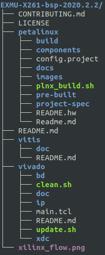
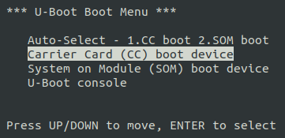
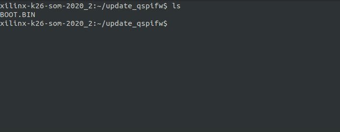
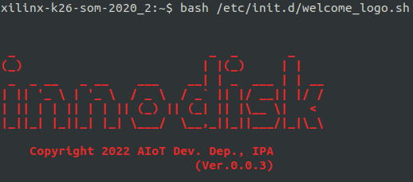
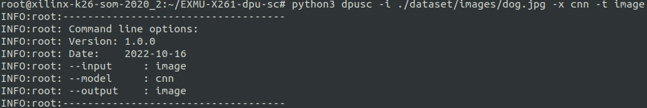
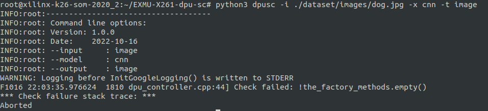
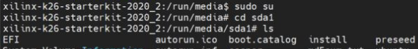

<!--
 Copyright (c) 2022 Innodisk crop.
 
 This software is released under the MIT License.
 https://opensource.org/licenses/MIT
-->


# FAQ
- [FAQ](#faq)
- [What is BSP?](#what-is-bsp)
- [How to flash eMMC on X261?](#how-to-flash-emmc-on-x261)
- [How to update QSPI FW?](#how-to-update-qspi-fw)
- [How to use xmutil to check Accelerate Application is loaded?](#how-to-use-xmutil-to-check-accelerate-application-is-loaded)
- [How to update the application on X261?](#how-to-update-the-application-on-x261)
- [How to check the verion on EXMU-X261?](#how-to-check-the-verion-on-exmu-x261)
- [Aborted to run dpu-sc?](#aborted-to-run-dpu-sc)
- [For first time boot, what is the login account and password?](#for-first-time-boot-what-is-the-login-account-and-password)
- [How to access USB?](#how-to-access-usb)

# What is BSP?
A Board Support Package (BSP) is a collection of drivers customized to the provided hardware description, and it also contains a lot of source code(like Petalinux, Vitis and Vivado etc.). Our BSP structure like below:  


# How to flash eMMC on X261?
1. You need to prepare a MicroSD Card which can boot on X261, then use it to boot the system.  
2. In U-Boot section, you can see the simple menu like below through debug board(UART), please select `Carrier Card (CC) boot device` here.   
  
1. After booting, you can follow below steps to flash the image which used to replace k26's eMMC, such like:  
   ```bash  
   sudo umount /dev/mmcblk0p1
   sudo umount /dev/mmcblk0p2
   echo -e "d\n\nd\n\nd\n\nw\n" | sudo fdisk /dev/mmcblk0
   sudo dd if=<reflash-image> of=/dev/mmcblk0 bs=1M status=progress 
   ```
2. Finnaly, after `reboot` then you can see the new system which you flashed.


# How to update QSPI FW?
For partition A.
```
sudo flashcp -v BOOT.BIN /dev/mtd5
```

For partition B.
```
sudo flashcp -v BOOT.BIN /dev/mtd7
```
Example of successfuly update qspifw.
    

# How to use xmutil to check Accelerate Application is loaded?
You can use `xmutil` to check the `listapps`. The active shows `1` means accelerate application is loaded.

```
xmutil listapps
```

<!--  -->

If the accelerate application not loaded. you can use `xmutil` to load accelerate application. And check the accelerate application list again.

<!--  -->

```
xmutil loadapp <accelerate application name>
```
<!--  -->


# How to update the application on X261?
All application support using RPM to upgrade.
  
# How to check the verion on EXMU-X261?
For BSP verion, using the following command to check. The BSP verion is `Ver.x.x.x`.

```
bash /etc/init.d/welcome_logo.sh
```



For Vitis-AI verion, using the following command to check. The Vitis-AI verion can be seen at `VAI Version`.
```
xdputil query
```


The dpu-sc not preload in our system. If you need to check dpu-sc verion, the verion shows when running dpu-sc.

 

For stesting verion, stesting can't check verion yet. Would be added in future verion.
   
# Aborted to run dpu-sc?
When running the dpu-sc and got the error as following shows. It is because system doeesn't load DPU accelerate application yet.



Please load DPU accelerate application. Double check accelerate application list. And run dpu-sc again.
```
xmutil loadapp <dpu accelerate application name>
```

# For first time boot, what is the login account and password?
Account name is `petalinux`. And you can set a new password at first time.

# How to access USB?
You can use the command `sudo su` to switch mode to `root` for accessing USB.


