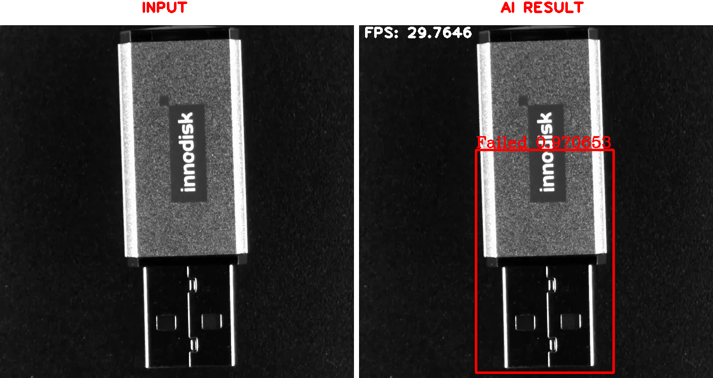

<!--
 Copyright (c) 2022 Innodisk crop.
 
 This software is released under the MIT License.
 https://opensource.org/licenses/MIT
-->
# TOC
- [Intorduction](#intorduction)
- [Defect Detection Solutions](#defect-detection-solutions)
- [Pre-build image](#pre-build-image)
   
# Intorduction
We create the defect detection solutions on EXMU-X261. When camera catch the image, the image will input to EXMU-X261. The EXMU-X261 will preprocess the image. After all, the DPU will inference image and output result with bounding box. The result will shows on screen.  

|Solution| Model | Input Size | AVG. FPS on X261 |
|:------:| :-------------: |:----: |:---:|
| Object detection | YOLOv4-tiny | 320x320  | ~35 FPS |

`In the following section we have presented 3 case studies for you with object detection solution.`

# Defect Detection Solutions 

 USB pendrive Defect Detection
  

This solution can be used in factory to detect the logo or the assembly of components error.

PASS

NG

Live demo  

 

Screw Defect Detection
  

This solution can be used in factory to detect the screw defect.

 

Pneumonia Detection

[COVID-19 Sniper: An advanced diagnostic taool for pneumonia](https://www.hackster.io/covid-19-sniper/covid-19-sniper-an-advanced-diagnostic-tool-for-pneumonia-70be48)  

# Pre-build image
We provide pre-built images that you can use to follow the [Getting Started](../0.Getting-Started/Getting-Started.md) guide to prepare the SD card. By switching X261 to boot from the SD card, you can experience our solution.
- USB pendrive Defect Detection
  - USB_122_AIBOX_230720.gz
- Screw Defect Detection
  - pneumonia_122_AIBOX_230720.gz
- Screw Defect Detection
  - screw_122_AIBOX_230720.gz

We also has other pre-built images which can be find on other relevant pages.